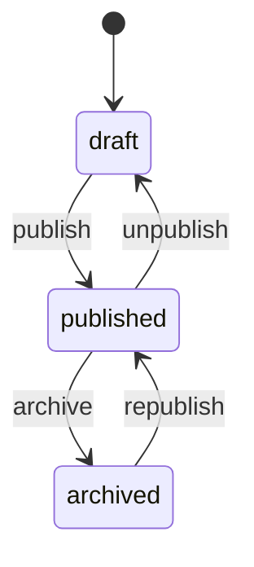
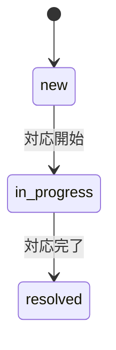
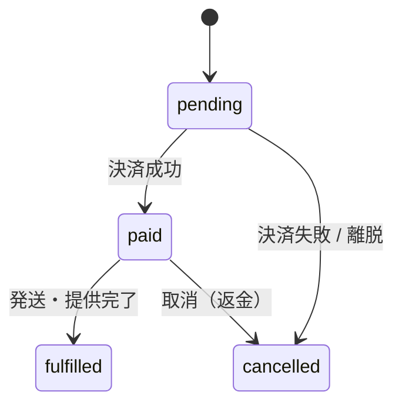

# 09-state-machine-spec.md — 状態遷移仕様テンプレート

## このセクションの目的

状態を持つエンティティの **状態一覧 / 遷移マトリクス / トリガー / 不正遷移時の挙動** を体系的に定義する。Service 層に集約する状態遷移関数の実装パターンも提供（DEV-01 §4「状態遷移の集約」参照）。

## 0-H. ハイブリッド編集ガイド（要点）

- 推奨モード: Hybrid（AI 整理 + Tech Lead レビュー）
- 人間確認必須: 遷移パスの妥当性、不正遷移時の挙動、監査ログ要件

---

## 1. 状態遷移を持つエンティティ一覧

PRD-01 §7 と整合させる。本テンプレート（パターン A）は単一運営・少数ロールが前提のため、Organization / Subscription / Invitation / Membership / Payment のようなマルチテナント SaaS 課金系のエンティティは存在しない（00_README §0-1・§2-2、PRD-01 §1）。標準エンティティ（Post / Inquiry）と、採用時のみ追加するオプションエンティティ（Member / AiJob / Order）を対象とする。

<!-- TEMPLATE: PRD-01 §7 の状態一覧と対応 -->
<!-- SAMPLE START: フォーマット例 — 実際のエンティティに置き換えてください -->
| エンティティ | 状態数 | 主な遷移トリガー |
| --- | --- | --- |
| Post | 3 | 公開操作・非公開化・アーカイブ（管理者操作、PRD-01 §7） |
| Inquiry | 3 | 対応開始・対応完了（管理者操作、PRD-01 §7） |
| Member（マイページ機能採用時のみ。PRD-03 FG-07） | 2 | 利用停止・復帰（管理者操作、PRD-01 §7） |
| [プロダクト固有エンティティ] | [N] | [遷移トリガー] |
| AiJob（AI 機能採用時のみ） | 4 | 非同期ジョブの実行（キュー投入・処理開始・完了・失敗） |
| Order（軽量 EC 採用時のみ。PRD-03 FG-05） | 4 | Stripe Webhook（決済成功等）・管理者操作（発送・提供完了等） |
<!-- SAMPLE END -->

---

## 2. エンティティ別の状態遷移定義

### 2-1. Post

<!-- SAMPLE START: フォーマット例 — 実際の内容に置き換えてください -->
#### 2-1-1. 状態一覧

PRD-01 §7 / DEV-07 §4-2（`posts.status`）と一致させる。

| 状態 | 説明 |
| --- | --- |
| `draft` | 下書き（非公開） |
| `published` | 公開中 |
| `archived` | 公開終了（アーカイブ） |

#### 2-1-2. 遷移マトリクス

| 遷移元 → 遷移先 | draft | published | archived |
| --- | :---: | :---: | :---: |
| draft | — | ✓ | ✗ |
| published | ✓ | — | ✓ |
| archived | ✗ | ✓ | — |

> `draft → archived` の直接遷移は無し（一度公開してからアーカイブする運用を想定）。`archived → published`（再公開）は許可する。§3-2 の `TRANSITIONS` 定義と一致させること。

#### 2-1-3. 遷移トリガー

| 遷移 | トリガー | 実行者 |
| --- | --- | --- |
| draft → published | 記事編集画面で「公開」操作 | admin / editor（DEV-02 §2-3 ※1 の判断に依存） |
| published → draft | 「非公開化」操作（unpublish） | admin（editor まで許可するかは案件次第） |
| published → archived | 「アーカイブ」操作 | admin |
| archived → published | 「再公開」操作（republish） | admin |

#### 2-1-4. 遷移時の副作用

| 遷移 | 副作用 |
| --- | --- |
| → published | `published_at` を記録（DEV-07 §4-2）。公開側の一覧・サイトマップに反映 |
| → draft（unpublish） | 公開側から非表示化 |
| → archived | 公開側から除外（データ自体は保持。保管方針は DEV-07 §10） |

#### 2-1-5. Mermaid


<!-- SAMPLE END -->

### 2-2. Inquiry

<!-- SAMPLE START: フォーマット例 — 実際の内容に置き換えてください -->
#### 2-2-1. 状態一覧

PRD-01 §7 / DEV-07 §4-7（`inquiries.status`）と一致させる。

| 状態 | 説明 |
| --- | --- |
| `new` | 新規受信・未対応 |
| `in_progress` | 対応中 |
| `resolved` | 対応完了 |

#### 2-2-2. 遷移マトリクス

| 遷移元 → 遷移先 | new | in_progress | resolved |
| --- | :---: | :---: | :---: |
| new | — | ✓ | ✗ |
| in_progress | ✗ | — | ✓ |
| resolved | ✗ | ✗ | — |

> `resolved` からの再オープン（`in_progress` への戻し）を許可するかは案件次第（**Open** — 案件実装時に確定。暫定方針: 誤操作復帰のため再オープン可 [Assumed]）。標準では `resolved` を終端状態とする。

#### 2-2-3. 遷移トリガー

| 遷移 | トリガー | 実行者 |
| --- | --- | --- |
| new → in_progress | 管理画面で対応担当者をアサイン（`handled_by` 設定） | admin（DEV-02 §2-3。Inquiry 対応は admin のみ操作可） |
| in_progress → resolved | 対応完了操作 | admin |

#### 2-2-4. 遷移時の副作用

| 遷移 | 副作用 |
| --- | --- |
| → in_progress | `handled_by` を記録（DEV-07 §4-7） |
| → resolved | 対応完了。利用者への完了連絡を行うかは案件次第（**Open** — 案件実装時に確定 と合わせて確定。PRD-03 FG-06 の受信時通知とは別の関心事） |

#### 2-2-5. Mermaid


<!-- SAMPLE END -->

### 2-3. [プロダクト固有エンティティ]

<!-- SAMPLE START: フォーマット例 — 実際のエンティティに置き換えてください -->
#### 2-3-1. 状態一覧

| 状態 | 説明 |
| --- | --- |
| `[状態名]` | [説明] |
| `[状態名]` | [説明] |

#### 2-3-2. 遷移マトリクス

| 遷移元 → 遷移先 | [状態 A] | [状態 B] | [状態 C] |
| --- | :---: | :---: | :---: |
| [状態 A] | — | ✓ | ✗ |
| [状態 B] | ✓ | — | ✓ |
| [状態 C] | ✗ | ✗ | — |

#### 2-3-3. 遷移トリガー

| 遷移 | トリガー | 権限 |
| --- | --- | --- |
| [状態 A] → [状態 B] | [ユーザー操作 / Webhook / バッチ] | [権限] |
<!-- SAMPLE END -->

### 2-4. AiJob（AI 機能採用時のみ）

<!-- SAMPLE START: フォーマット例 — 採用時に実際の内容を確認してください -->
#### 2-4-1. 状態一覧

DEV-07 §3-4 / §6（`ai_jobs.status`）と一致させる。

| 状態 | 説明 |
| --- | --- |
| `queued` | キュー投入済、実行待ち |
| `processing` | 実行中 |
| `completed` | 完了 |
| `failed` | 失敗（リトライ上限到達） |

#### 2-4-2. 遷移マトリクス

| 遷移元 → 遷移先 | queued | processing | completed | failed |
| --- | :---: | :---: | :---: | :---: |
| queued | — | ✓ | ✗ | ✓ |
| processing | ✓ | — | ✓ | ✓ |
| completed | ✗ | ✗ | — | ✗ |
| failed | ✗ | ✗ | ✗ | — |

> `processing → queued` はリトライ時の戻し。
<!-- SAMPLE END -->

### 2-5. Order（軽量 EC 採用時のみ — PRD-03 FG-05）

Order は FG-05（軽量注文・決済）採用時のみの **オプション例**。採用しない場合は本節を削除する。DEV-07 §7-1（`orders.status`）と一致させる。ゲストチェックアウトと Member への任意紐付け（FG-07 採用時、`orders.member_id`）の両方を前提とし、複雑な承認フロー・在庫同期は対象外（00_README §2-2、PRD-01 §1-1・§1-3）。

<!-- SAMPLE START: フォーマット例 — 実際の内容に置き換えてください -->
#### 2-5-1. 状態一覧

| 状態 | 説明 |
| --- | --- |
| `pending` | 注文受付・決済処理待ち |
| `paid` | 決済完了（`stripe_payment_intent_id` 確定） |
| `fulfilled` | 発送・提供完了 |
| `cancelled` | 取消（決済失敗・利用者キャンセル・返金等） |

#### 2-5-2. 遷移マトリクス

| 遷移元 → 遷移先 | pending | paid | fulfilled | cancelled |
| --- | :---: | :---: | :---: | :---: |
| pending | — | ✓ | ✗ | ✓ |
| paid | ✗ | — | ✓ | ✓ |
| fulfilled | ✗ | ✗ | — | ✗ |
| cancelled | ✗ | ✗ | ✗ | — |

> `fulfilled` / `cancelled` は終端状態。返金は Stripe 側の操作として記録し、本テーブルの `status` は `cancelled` に遷移させる運用を想定する（返金専用の状態は持たず、シンプルな 4 状態に留める — DEV-07 §7-1）。再決済は新規 Order レコードを作成する。

#### 2-5-3. 遷移トリガー（Stripe Webhook ベース）

| 遷移 | トリガー | 実行者 |
| --- | --- | --- |
| pending → paid | Stripe Webhook（`checkout.session.completed` 等） | system |
| pending → cancelled | Stripe Webhook（決済失敗）、または利用者の離脱タイムアウト | system |
| paid → fulfilled | 管理画面での発送・提供完了操作（FG-04 と連動） | admin |
| paid → cancelled | 管理画面での取消操作（返金処理と合わせて実施） | admin |

#### 2-5-4. 遷移時の副作用

| 遷移 | 副作用 |
| --- | --- |
| → paid | 注文確認メール送信（利用者宛、F-05-04）。`stripe_event_logs` へ Webhook イベントを記録（DEV-07 §7-3、冪等性確保） |
| → fulfilled | 発送・提供完了メールの送信有無は案件次第（**Open** — 案件実装時に確定） |
| → cancelled | 取消連絡メールの送信有無は案件次第（**Open** — 案件実装時に確定） |

#### 2-5-5. Mermaid


<!-- SAMPLE END -->

### 2-6. Member（マイページ機能採用時のみ — PRD-03 FG-07）

Member は FG-07 採用時のみの **オプション例**。採用しない場合は本節を削除する。DEV-07 §4-10（`members.status`）と一致させる。ロール階層を持たない単一種別のため、遷移は有効／利用停止の 2 状態のみ（PRD-01 §1-2・§7）。

<!-- SAMPLE START: フォーマット例 — 実際の内容に置き換えてください -->
#### 2-6-1. 状態一覧

| 状態 | 説明 |
| --- | --- |
| `active` | 有効（ログイン可） |
| `suspended` | 利用停止（ログイン不可。既存セッションも失効させる） |

#### 2-6-2. 遷移マトリクス

| 遷移元 → 遷移先 | active | suspended |
| --- | :---: | :---: |
| active | — | ✓ |
| suspended | ✓ | — |

#### 2-6-3. 遷移トリガー

| 遷移 | トリガー | 実行者 |
| --- | --- | --- |
| active → suspended | 規約違反・退会申請等による利用停止操作 | admin |
| suspended → active | 停止解除操作 | admin |

#### 2-6-4. 遷移時の副作用

| 遷移 | 副作用 |
| --- | --- |
| → suspended | `member_sessions` の該当行を全削除してログイン中のセッションを即時失効させる（DEV-02 §1-2、DEV-07 §4-11） |
| → active | 副作用なし（再ログインで新規セッションが発行される） |

<!-- SAMPLE END -->

---

## 3. Service 層での状態遷移関数実装パターン

状態遷移は DEV-01 §4「状態遷移の集約」の原則に従い、エンティティごとに単一の遷移関数へ集約する（PHP のクラスベース StateMachine ではなく、Service 層の関数としてまとめる）。

### 3-1. 設計方針

| 項目 | 方針 |
| --- | --- |
| 配置 | `apps/admin/src/lib/server/services/<entity>.ts` に `transition<Entity>(...)` 関数としてエクスポート |
| 責務 | 遷移可否の判定、遷移実行（D1 更新）、副作用の呼び出し |
| 状態の保管 | D1 の `status` 等 `TEXT` カラム。TypeScript 側は文字列リテラルのユニオン型（例 `PostStatus`）で表現し、Service 層で検証する（`casts()` 相当の専用機構はない） |
| 不正遷移 | 専用の Error サブクラス（例 `InvalidTransitionError`）を throw する |
| 副作用 | イベントバス／Listener に相当する仕組みはない。遷移関数内から直接関数呼び出し（メール送信等）。レスポンスをブロックする重い副作用は `ctx.waitUntil()` で後処理化する（DEV-01 §4、DEV-05 §4） |

### 3-2. 実装例

<!-- TEMPLATE: Post は例示エンティティ。プロダクト固有エンティティに読み替えて使用する -->

```typescript
// apps/admin/src/lib/server/services/posts.ts

export type PostStatus = "draft" | "published" | "archived";

const TRANSITIONS: Record<PostStatus, PostStatus[]> = {
  draft: ["published"],
  published: ["draft", "archived"],
  archived: ["published"],
};

export class InvalidTransitionError extends Error {
  constructor(entity: string, from: string, to: string) {
    super(`Invalid transition for ${entity}: ${from} -> ${to}`);
  }
}

export async function transitionPost(env: Env, postId: number, to: PostStatus, actorId: number): Promise<void> {
  const post = await getPostById(env, postId); // 取得処理は省略

  const allowed = TRANSITIONS[post.status] ?? [];
  if (!allowed.includes(to)) {
    throw new InvalidTransitionError("Post", post.status, to);
  }

  const from = post.status;

  await env.DB.prepare("UPDATE posts SET status = ?, updated_at = ? WHERE id = ?").bind(to, new Date().toISOString(), postId).run();

  // 副作用は遷移関数内から直接呼び出す（イベント発火の仕組みはない）
  if (to === "published") {
    await notifyPostPublished(post, from);
  } else if (to === "archived") {
    await notifyPostArchived(post, from);
  }

  await recordTransition(env, "Post", postId, from, to, actorId); // §3-4
}

export function allowedTransitions(status: PostStatus): PostStatus[] {
  return TRANSITIONS[status] ?? [];
}
```

> `actorId` は監査ログ（§3-4）に記録する操作者の `admin_users.id`。マルチテナントではないため `organizationId` のようなテナント境界パラメータは持たない（DEV-01 §4「認可チェックの徹底」）。呼び出し元（API Route）が `requireRole(session, ...)`（DEV-02 §3-2）でロール検証済みであることを前提とする。

### 3-3. API Route からの呼び出し

遷移関数自体が Service 層に置かれるため、Astro API Route は入出力ハンドリングのみを担い、業務判定・D1 更新は `transitionPost` に委譲する（DEV-01 §5「レイヤー責務」）。

```typescript
// apps/admin/src/pages/api/v1/posts/[id]/publish.ts
import type { APIContext } from "astro";
import { env } from "cloudflare:workers"; // Astro.locals.runtime.env は v6 で削除済みの旧 API（採用する v7 にも無い — DEV-05 §1）
import { transitionPost } from "../../../../lib/server/services/posts";

export async function POST({ params, cookies }: APIContext): Promise<Response> {
  const db = createDb(env.DB); // 取得処理は省略。実際は Service 層で Drizzle 経由（DEV-05 §2）
  const session = await requireSession(cookies, db); // D1 セッション検証（DEV-02 §1-1）
  requireRole(session, "admin"); // editor まで許可するかは §2-1-3 ※案件判断に従う
  const post = await getPostByPublicId(db, params.id!); // URL キーは public_id（DEV-07 §1）
  await transitionPost(env, post.id, "published", session.adminUserId); // §3-2 のシグネチャに一致させる
  return new Response(null, { status: 204 });
}
```

> この節のコードは状態遷移の**考え方**を示す簡略例であり、`env.DB.prepare()` の直書き・内部 `id` の使用は DEV-05 §2/DEV-07 §1 の規約（Drizzle 経由・URL キーは `public_id`）を簡略化したもの。実装済みの参照実装は `apps/admin/src/lib/server/services/posts.ts`・`apps/admin/src/pages/api/v1/posts/`（DEV-05 §1・§2 で確定した規約に従う）。
>
> D1 は複数ステートメントをまとめて実行する `env.DB.batch()` を提供するが、Eloquent の `DB::transaction()` のような任意ロジックを包むトランザクション機構ではない。遷移関数内で複数テーブルを更新する場合（本体 UPDATE + `activity_log` INSERT 等）は必ず `batch()` で 1 トランザクションにまとめる（DEV-05 §3 で確定済み）。

### 3-4. 監査ログとの連携

状態遷移は監査ログの必須記録操作（DEV-05 §9-1）。専用パッケージは使わず、遷移関数内から
`activity_log` テーブル（DEV-01 §2 / DEV-07 §4-8）へ直接 INSERT する。単一運営前提のため `organization_id` は持たない（DEV-07 §4-8）。

```typescript
// 状態遷移を行った関数内で記録する（DEV-05 §9-1）
async function recordTransition(env: Env, subjectType: string, subjectId: number, from: string, to: string, causerId: number): Promise<void> {
  await env.DB.prepare(
    `INSERT INTO activity_log (log_name, description, subject_type, subject_id, event, causer_type, causer_id, properties, created_at)
     VALUES (?, ?, ?, ?, ?, ?, ?, ?, ?)`,
  )
    .bind("content", `${subjectType} #${subjectId} status changed: ${from} -> ${to}`, subjectType, subjectId, `${subjectType.toLowerCase()}.status_changed`, "AdminUser", causerId, JSON.stringify({ old: { status: from }, attributes: { status: to } }), new Date().toISOString())
    .run();
}
```

---

## 4. UI 表示

### 4-1. 状態バッジの標準色

<!-- TEMPLATE: 本テンプレートの標準エンティティ（Post / Inquiry）とオプションエンティティ（AiJob / Order）の状態をカテゴリ化 -->

| 状態カテゴリ | 色 | アイコン例 |
| --- | --- | --- |
| Published / Resolved / Fulfilled / Completed / Paid | 緑 | check-circle |
| Draft / New / Pending / Queued | 黄 | clock |
| In Progress / Processing | 青 | arrow-path |
| Archived / Cancelled | グレー | archive-box |
| Failed | 赤 | exclamation-circle |

### 4-2. 状態遷移ボタンの表示

遷移可否の判定はコンポーネント側で個別実装せず、§3-2 の `allowedTransitions()` の結果を Astro ページ（または API Route）側で取得し、Svelte アイランドに props として渡して描画する。

```svelte
<!-- Svelte island: 許可された遷移のみボタン表示 -->
<script lang="ts">
  import type { PostStatus } from "../lib/server/services/posts";

  let { allowedTransitions, onSelect }: { allowedTransitions: PostStatus[]; onSelect: (status: PostStatus) => void } = $props();
</script>

{#each allowedTransitions as nextStatus}
  <button onclick={() => onSelect(nextStatus)}>{nextStatus}</button>
{/each}
```

遷移の確認は共通の確認モーダルに集約する（ブラウザ標準ダイアログ `confirm()` は使わない —
DEV-01 §3 / DEV-06 §5）。管理画面では shadcn-svelte の `AlertDialog` 等、標準の確認 UI コンポーネントを使う（`npx shadcn-svelte add alert-dialog`）。

```svelte
<script lang="ts">
  import * as AlertDialog from "$lib/components/ui/alert-dialog";
  import type { PostStatus } from "../../lib/server/services/posts";

  let { postId }: { postId: number } = $props();
  let pendingStatus: PostStatus | null = $state(null);

  async function applyTransition(): Promise<void> {
    if (!pendingStatus) return;
    await fetch(`/api/v1/posts/${postId}/transition`, {
      method: "POST",
      body: JSON.stringify({ to: pendingStatus }),
    });
    pendingStatus = null;
  }
</script>

<AlertDialog.Root open={pendingStatus !== null}>
  <AlertDialog.Content>
    <AlertDialog.Title>状態を変更しますか？</AlertDialog.Title>
    <AlertDialog.Action onclick={applyTransition}>変更する</AlertDialog.Action>
  </AlertDialog.Content>
</AlertDialog.Root>
```

---

## 5. テスト戦略

<!-- TEMPLATE: Post は例示エンティティ。プロダクト固有エンティティに読み替えて使用する -->

テストツールは Vitest に確定済み（DEV-01 §1）。「全ての状態遷移パターンにテストがあること」を目標として維持する。以下は Vitest での実装イメージ。

### 5-1. Unit Test

```typescript
import { describe, it, expect } from "vitest";
import { transitionPost, InvalidTransitionError } from "../../lib/server/services/posts";

it("allows draft to published", async () => {
  const post = await createTestPost({ status: "draft" });

  await transitionPost(env, post.id, "published", actorId);

  const updated = await getPostById(env, post.id);
  expect(updated.status).toBe("published");
});

it("rejects draft to archived", async () => {
  const post = await createTestPost({ status: "draft" });

  await expect(transitionPost(env, post.id, "archived", actorId)).rejects.toThrow(InvalidTransitionError);
});

it("calls the publish side-effect on publish", async () => {
  const post = await createTestPost({ status: "draft" });
  const spy = vi.spyOn(notifications, "notifyPostPublished");

  await transitionPost(env, post.id, "published", actorId);

  expect(spy).toHaveBeenCalled();
});
```

### 5-2. データセットでマトリクス全網羅

```typescript
it.each([
  ["draft", "published", true],
  ["draft", "archived", false],
  ["published", "draft", true],
  ["archived", "published", true],
  // ... 全組み合わせ
])("transition matrix: %s -> %s (allowed=%s)", async (from, to, allowed) => {
  const post = await createTestPost({ status: from as PostStatus });

  if (allowed) {
    await expect(transitionPost(env, post.id, to as PostStatus, actorId)).resolves.not.toThrow();
  } else {
    await expect(transitionPost(env, post.id, to as PostStatus, actorId)).rejects.toThrow(InvalidTransitionError);
  }
});
```

---

## 6. 状態遷移の可視化

### 6-1. Mermaid 図の標準形


### 6-2. ドキュメント記載順序

各エンティティについて、以下の順序で記載：

1. 状態一覧表
2. 遷移マトリクス表
3. 遷移トリガー（操作主体）
4. 副作用（イベント・通知）
5. Mermaid 状態遷移図

---

## 7. 記入時チェックポイント

- 状態を持つエンティティが PRD-01 §7 と整合しているか
- 各エンティティの状態値が DEV-07 の `status` カラム定義（`posts` / `inquiries`、採用時は `orders` / `ai_jobs` 等）と一致しているか
- Organization / Subscription / Invitation / Membership / Payment のようなマルチテナント SaaS 課金系のエンティティが紛れ込んでいないか（本テンプレは単一運営が前提。00_README §0-1・§2-2）
- 遷移マトリクスで「不可能な遷移」が明示されているか
- 遷移トリガーが明確か（system / admin / editor / Webhook）
- 副作用が網羅されているか（メール通知、関連エンティティへの影響）
- 監査ログとの連携が組み込まれているか（`organization_id` のようなテナント列を持たない `activity_log` の実スキーマ、DEV-07 §4-8 と一致しているか）
- 状態遷移関数が Service 層に集約され、API Route から呼ばれる構造になっているか（`organizationId` ではなく `actorId` 等のロール検証に必要な引数のみを持つか）
- 不正遷移時の挙動（例外 / エラー画面）が明示されているか
- 採用しないオプションエンティティ（Member / AiJob / Order）の節が、不要な場合に削除されているか
